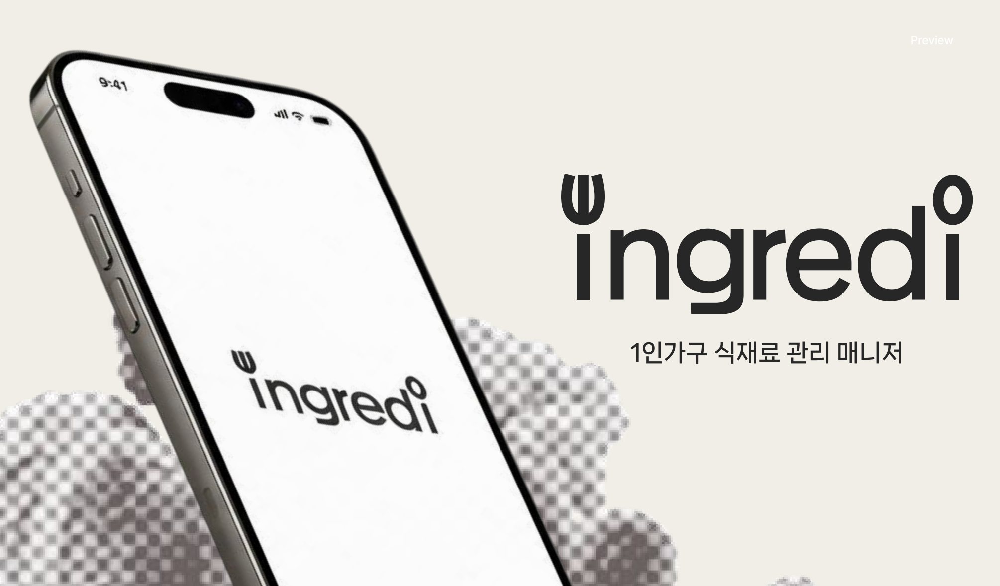
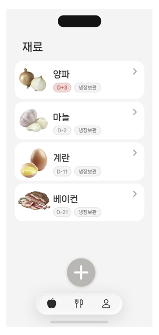
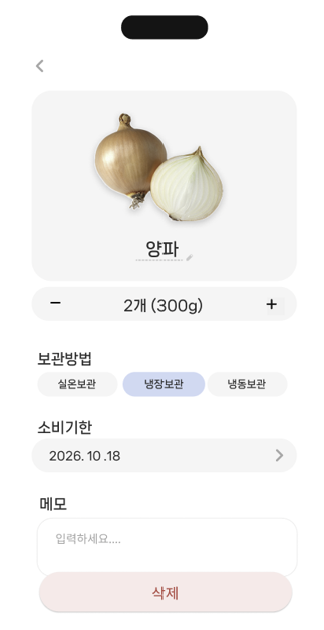
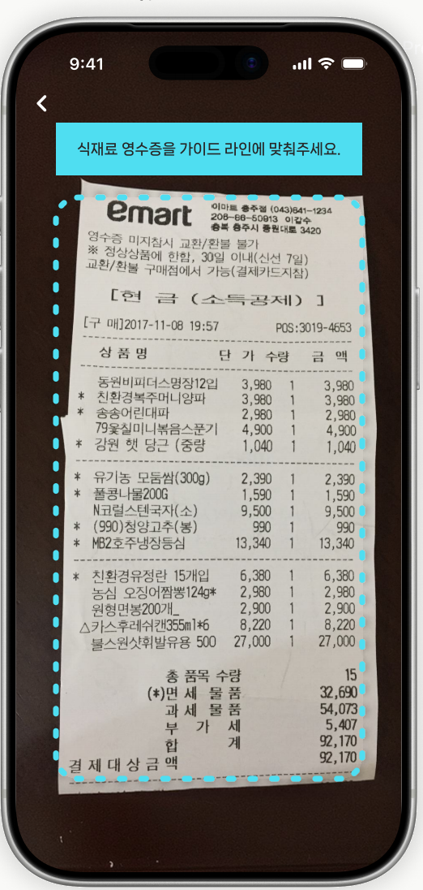
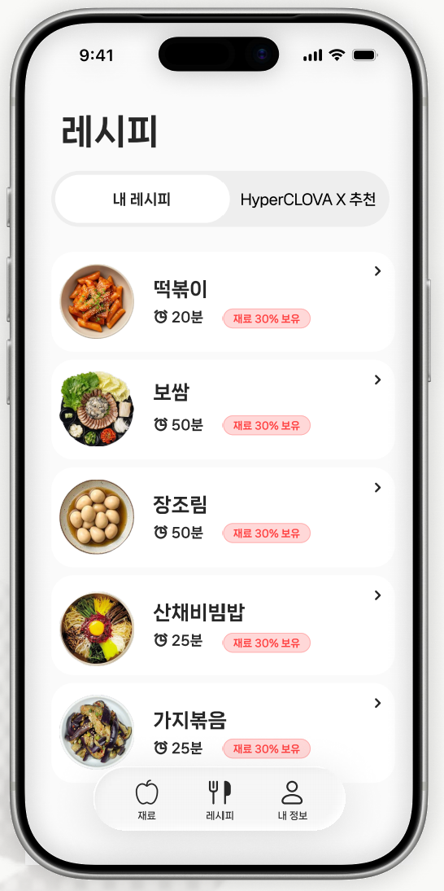
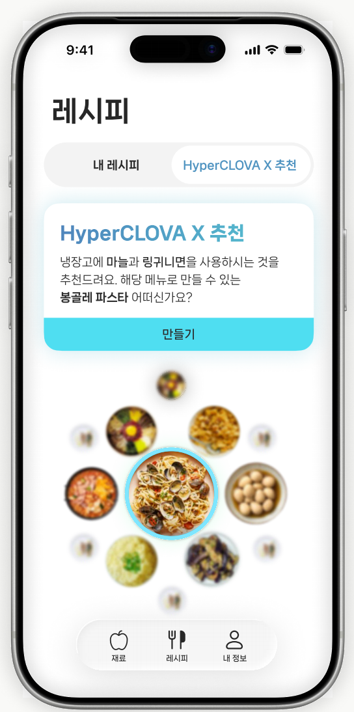
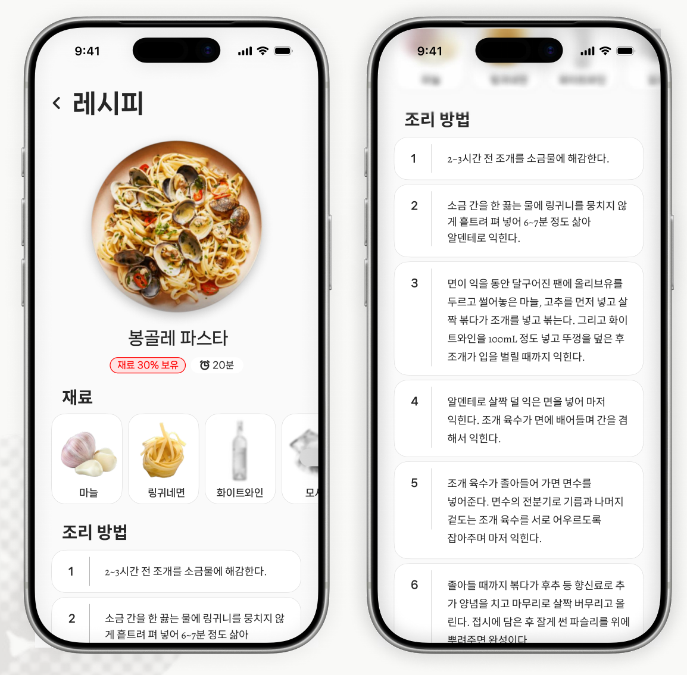

# 릿톤 (Littone) — 1인 가구 식재료 관리 매니저

> 2026 LIMIT:AI HACKATHON (경희대, HyperCLOVA X 기반) · **15팀 「8구 멀티탭」**
> 영수증 한 장으로 냉장고 재료를 등록하고, 소비기한을 챙기고, 지금 있는 재료로 만들 수 있는 요리를 추천받는 웹 서비스



---

## 1. 문제 정의

1인 가구는 장보기부터 요리, 재료 관리까지 모든 가사를 혼자 합니다. 그래서 두 가지가 특히 어렵습니다.

1. **식재료 소비기한 관리** — 무엇이 언제까지인지 기억하기 어렵고, 모르는 사이에 버리게 됩니다.
2. **식재료에 맞는 레시피 탐색** — 요리가 익숙하지 않으면 냉장고에 있는 재료를 어떤 순서로, 무엇으로 만들어 먹어야 할지 구상하기 어렵습니다.

## 2. 핵심 기능

| 기능 | 설명 |
|---|---|
| 🧾 **영수증 스캔 등록** | 영수증 사진을 올리면 CLOVA OCR이 글자를 읽고, HyperCLOVA X가 식재료만 골라 재료명 · 개수 · 보관 방법 · 권장 소비기한으로 정리합니다. 사용자는 확인 후 선택한 재료만 등록합니다. |
| ⏰ **소비기한 표시와 경고** | 재료마다 `D-3`, `D-Day`, `D+3`처럼 남은 날짜를 보여줍니다. 지난 재료는 빨간색, 3일 이내는 주황색으로 표시합니다. |
| 🍳 **레시피 + 재료 보유율** | 저장된 레시피마다 냉장고 재료로 몇 %를 채울 수 있는지(재료 N% 보유)와 조리 시간, 단계별 조리 방법을 보여줍니다. |
| 🤖 **HyperCLOVA X 레시피 추천** | 소비기한이 임박한 재료를 우선으로 활용하는 요리를 추천하고, 「만들기」를 누르면 내 레시피에 저장합니다. |
| 🥬 **재료 관리** | 재료의 개수, 보관 방법(실온/냉장/냉동), 소비기한, 메모를 수정하거나 삭제할 수 있습니다. |

## 3. 화면 미리보기

| 재료 목록 | 재료 상세 | 영수증 스캔 |
|---|---|---|
|  |  |  |

| 내 레시피 | HyperCLOVA X 추천 | 레시피 상세 |
|---|---|---|
|  |  |  |

## 4. HyperCLOVA X 활용

| 어디서 | 무엇을 | 입력 → 출력 |
|---|---|---|
| 영수증 스캔 | 영수증 상품명에서 식재료만 추리고 정리 | OCR로 읽은 상품명 목록 → `{name, qty, storage, shelf_life_days}` JSON 배열 |
| 레시피 추천 | 소비기한이 임박한 재료를 우선 활용하는 요리 추천 | 냉장고 재료(임박순) → `{used, recipe{name, minutes, ingredients, steps}}` JSON |

- 모델 응답은 **JSON 형식으로만** 출력하도록 시스템 프롬프트에 규칙을 고정하고, 서버에서 파싱해 화면에 연결합니다.
- 코드 상 기본 모델은 `HCX-005`이며 환경 변수 `CLOVASTUDIO_MODEL`로 바꿀 수 있습니다.
- 소비기한은 AI가 제안한 **권장 일수**이고, 사용자가 등록 전에 직접 수정할 수 있습니다.

## 5. 서비스 구조

```
[브라우저: HTML/CSS/JS]
        │  fetch (JSON)
        ▼
[FastAPI 서버 app.py] ──── CLOVA OCR (영수증 글자 인식)
        │            └─── HyperCLOVA X (재료 정리 · 레시피 추천)
        ▼
[SQLite littone.db]  재료 · 레시피 저장
```

- API 키는 `.env`로 서버에서만 사용하며 브라우저에 노출하지 않습니다.
- 키가 없거나 호출이 실패하면 **기본(데모) 데이터로 동작**합니다. 영수증 스캔은 화면에 "데모 데이터로 표시 중"이라고 안내하고, 레시피 추천은 재료 보유율이 가장 높은 기본 레시피를 보여줍니다.

### 주요 API

| 메서드 | 경로 | 설명 |
|---|---|---|
| GET / POST | `/api/ingredients` | 재료 목록 / 추가 |
| POST | `/api/ingredients/bulk` | 영수증 후보 재료 일괄 등록 |
| GET / PATCH / DELETE | `/api/ingredients/{id}` | 재료 조회 / 수정 / 삭제 |
| POST | `/api/receipt` | 영수증 이미지 → 재료 후보 |
| GET / POST | `/api/recipes` | 레시피 목록(보유율 포함) / 저장 |
| GET | `/api/recipes/{id}` | 레시피 상세 |
| GET | `/api/recommend` | HyperCLOVA X 레시피 추천 |

## 6. 기술 스택

- **Frontend**: HTML · CSS · JavaScript (Figma에서 추출한 디자인 기반)
- **Backend**: Python · FastAPI · SQLite
- **AI**: HyperCLOVA X (CLOVA Studio), CLOVA OCR
- **Design**: Figma
- **협업**: GitHub

## 7. 실행 방법

```bash
# 1. 의존성 설치
pip install -r requirements.txt

# 2. 환경 변수 설정 (.env 파일을 만들어 아래 값 입력)
#    키가 없으면 데모 모드로 실행됩니다.
```

`.env` 예시 (실제 키는 절대 저장소에 올리지 마세요)

```env
CLOVASTUDIO_API_KEY=여기에_키
CLOVASTUDIO_MODEL=HCX-005
CLOVA_OCR_INVOKE_URL=여기에_OCR_주소
CLOVA_OCR_SECRET_KEY=여기에_OCR_시크릿
```

```bash
# 3. 서버 실행
python app.py
# 4. 브라우저에서 http://127.0.0.1:8000 접속
```

## 8. 폴더 구조

```
.
├── app.py             # FastAPI 서버 (API · DB · HyperCLOVA X / OCR 호출)
├── app/               # Figma에서 추출한 HTML/CSS 및 웹 구현 파일
├── requirements.txt   # 파이썬 의존성
└── docs/images/       # README 이미지
```

## 9. 팀 소개

**15팀 8구 멀티탭**

| 이름 | 역할 |
|---|---|
| 서연 ([@elregansekwon](https://github.com/elregansekwon)) | 기획, 개발 |
| (이름 입력) | (역할 입력) |
| (이름 입력) | (역할 입력) |

## 10. 개발 과정과 토큰 사용

- 기획 구체화에 약 2,000~3,000 토큰을 쓰고, 나머지는 개발에 사용했습니다.
- 디자인은 Figma로 직접 제작한 뒤 HTML/CSS로 추출했고, HyperCLOVA X로 서버(`app.py`)와의 연동 코드를 작성했습니다.
- 코드 생성 시 설정: Temperature 0.1~0.2, Top P 0.7~0.8, Top K 0, Max Tokens 2,048~4,096, Repetition Penalty 1.0
- 자세한 내용은 제출한 Token Comment를 참고해 주세요.

## 11. 한계와 향후 계획

- 소비기한은 AI 제안값이므로 식품 표시 기한과 다를 수 있어 사용자 확인이 필요합니다.
- 현재는 한 사용자의 로컬 데이터(SQLite) 기준이며 로그인과 여러 사용자 기능은 없습니다.
- 영수증 인식 정확도는 사진 상태에 따라 달라지고, 인식 결과는 사용자가 확인 후 등록합니다.
